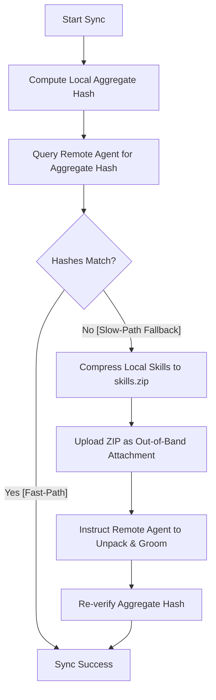

# Paperclip-OpenClaw Bridge: Skill Sync Interaction Protocol

This document defines the formal schema, actions, and control flow for synchronizing skill packages between Paperclip and OpenClaw.

---

## 1. High-Level Workflow

The synchronization process ensures the remote agent's workspace (`~/.openclaw/skills/`) mirrors the local Paperclip skill repository. To achieve maximum speed and token efficiency, the protocol implements a **Fast-Path Verification** with an **Atomic ZIP Fallback**.



### Protocol Steps
1.  **State Synthesis**: The bridge scans all local skill files, compiles a deterministic skill manifest, and computes a SHA-256 **Aggregate State Hash** representing the absolute state of local skills.
2.  **Fast-Path Verification**:
    -   The bridge queries the remote agent using a single optimized shell instruction (`ACTION: GET_AGGREGATE_HASH`).
    -   The remote agent executes a high-performance shell pipeline (`find | sort | sha256sum`) and returns its aggregate hash.
    -   If the hashes match, the verification is marked successful instantly (**Fast-Path**), completing without uploading any files.
3.  **Atomic Fallback Sync**:
    -   If a mismatch or directory absence is detected, the bridge falls back to a single **Atomic ZIP Injection**.
    -   The bridge bundles all skills into a single `.zip` archive (`skills.zip`).
    -   The archive is uploaded as a single binary attachment via the **Out-of-band Attachment** pathway.
    -   The bridge issues a single instruction (`ACTION: WRITE_BATCH`) instructing the agent to unpack the archive at `~/.openclaw/skills/` and prune any obsolete (orphaned) skill directories.
4.  **Convergence Gate**:
    -   The process verifies the aggregate state again. It retries up to 3 times to ensure 100% convergence before proceeding.

---

## 2. Message Schema

All skill sync communications follow a clean text block format designed to be parsed reliably by agent models.

### Protocol Block Template
```text
[PROTOCOL:SKILL_SYNC]
ACTION: <ACTION_NAME>
[METADATA_KEY: <VALUE>]
...
INSTRUCTION:
<DETAILED_BEHAVIORAL_INSTRUCTIONS>
```

---

## 3. Atomic ZIP Sync Protocol (WRITE_BATCH)

This is the recovery mechanism utilized when the aggregate state hash fails to match.

### A. Communication Sequence
1.  **Bridge**: Prepares the `skills.zip` binary in memory and sends a `chat.send` RPC with:
    -   The `WRITE_BATCH` action instruction.
    -   An **Attachment** (MIME: `application/zip`, Name: `skills.zip`).
2.  **OpenClaw**: Receives the message and staging attachment, placing the file in its remote media directory.
3.  **Agent**: Extracts the staging attachment:
    -   Moves/copies `skills.zip` to `~/.openclaw/skills/`.
    -   Unzips the archive, overwriting existing files.
    -   Grooms the folder by matching the directory layout in the zip, deleting any untracked folders or stray legacy files.
    -   Cleans up temporary ZIP staging files.
4.  **Response**: The agent returns `OK` upon successful extraction and grooming.

### B. Benefits of Atomic ZIP Delivery
-   **Context Preservation**: Binary uploads bypass LLM token windows, saving thousands of tokens per synchronization.
-   **Clean Extraction**: Ensures all nested directories and dependency trees are created atomically, avoiding partial updates or broken imports.
-   **Grooming & Orphan Pruning**: Resolves remote drift by purging older, obsolete skills that were deleted from the local control plane.

---

## 4. Action Definitions

| Action | Description | Expected Response |
| :--- | :--- | :--- |
| `GET_AGGREGATE_HASH` | Computes the remote skills folder aggregate SHA-256 checksum. | Hexadecimal SHA-256 hash or `MISSING` |
| `WRITE_BATCH` | Extracts the uploaded `skills.zip` and grooms the destination. | `OK` |

---

## 5. Control Flow & Routing

The bridge operates a lightweight, stateless execution control flow:
-   **Session Key Routing**: Outbound events and inbound WebSockets are dynamically routed using a unique `sessionKey` mapped to the bridge execution context.
-   **Direct Wait Signal**: Instead of managing complex state loops, the bridge relies on direct `agent.wait` completion signals, allowing remote extraction jobs to complete asynchronously and notify the caller upon termination.

---

## 6. Configuration Controls

### `enableSkillSync`
A boolean toggle configuration parameter:
-   `true`: Evaluates the aggregate state and runs the synchronization workflow.
-   `false` (Default): Bypasses all skill verification checks entirely, immediately proceeding to task execution.
